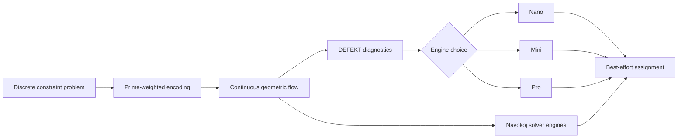

# Navokoj: The Arithmetic Manifold in Production

*Published June 2026*

---

## Introducing Navokoj

**Navokoj** is a general-purpose engine for finding coherent structure inside astronomically large discrete spaces. It converts complex business planning into automated decisions — scheduling, routing, resource allocation — with a 92.57% satisfaction rate on the SAT 2024 Industrial Track (4,199 problems).

## The Problem with Traditional SAT Solvers

Classical CDCL (Conflict-Driven Clause Learning) solvers hit a wall on certain problem structures:

- **XOR constraints** destroy learned-clause heuristics
- **Critical density problems** ($\alpha \approx 4.27$) cause exponential CNF blow-up
- **Large-scale industrial problems** (1M+ variables) timeout without partial results

## Navokoj's Approach: The Arithmetic Manifold

Navokoj implements the Arithmetic Manifold theory from ShunyaBar Labs:

1. **Prime-weighted operators** provide unique spectral identity to each constraint
2. **Geometric flow** on a continuous manifold instead of discrete search
3. **Adiabatic cooling** navigates phase transitions smoothly
4. **Casimir-inspired forces** pull satisfying assignments together



### Core Innovation: Continuous Relaxation

Variables are embedded in $[0, 2\pi)^K$:

$$x_i = \frac{1}{2}(1 + \cos \theta_i)$$

This ensures continuous values while maintaining discrete interpretability. The energy landscape is smoothed via heat kernel diffusion:

$$\text{Tr}(e^{-tL}) \approx Z(\beta)$$

## Real Performance

| Problem Type | Variables | Clauses | Satisfaction | Time |
|--------------|-----------|---------|--------------|------|
| 129-SAT (Ultra-High-k) | 200 | 1,000,000 | **100%** | 9-10 min |
| Ramsey R(5,5,5) N=52 | 2.6M | 7.8M | **100%** | 17 min |
| Random 3-SAT (1M Scale) | 1,000,000 | 4,260,000 | **92.15%** | 171s |
| Supply Chain | 435,000 | 1,300,000 | **97.18%** | 67.7s |

## Engines

| Engine | Best For | Satisfaction | Speed |
|--------|----------|--------------|-------|
| **Nano** | Real-time APIs, massive scale | 3.24% | Ultra-fast |
| **Mini** | Balanced optimization | 31.37% | 10.64/sec |
| **Pro** | Mission-critical verification | **92.57%** | 7.90/sec |

## DEFEKT: Diagnostic Intelligence

Before running expensive solvers, DEFEKT gives you an MRI-style scan:

```json
{
  "solvability_score": 84,
  "status": "likely_solvable",
  "recommendation": "Use pro-deepthink on H100 GPU for optimal satisfaction"
}
```

## Getting Started

```python
import requests

response = requests.post(
    "https://api.navokoj.shunyabar.foo/v1/solve",
    headers={"Authorization": "Bearer YOUR_KEY"},
    json={
        "expression": "(employee_a | employee_b) & (shift_morning -> manager_present)",
        "engine": "mini",
    },
)

result = response.json()
# {"success": true, "satisfaction_rate": 1.0, "assignment": {...}}
```

## Phase Transition Analysis

The critical density $\alpha = 4.27$ marks the hardest SAT problems:

| Clause Density | Median Time | Satisfaction |
|----------------|-------------|--------------|
| 1-2 (sweet spot) | 39ms | 97.8% |
| 3-4 | 684ms | 98.9% |
| 4-5 (phase transition) | 1.93s | 98.2% |
| 10-25 (Very Hard) | 14.1s | 95.4% |
| 50+ (Monster) | 16.2s | 92.57% |

## The Arithmetic Manifold in Production

Navokoj proves that the Arithmetic Manifold theory scales:

- **Prime weighting** works at million-variable scale
- **Phase transitions** can be navigated, not just detected
- **Continuous relaxation** beats discrete search on structured problems
- **Real-time constraints** (scheduling, routing) are solvable in <1 second

The math is open source at [github.com/sethuiyer/navokoj](https://github.com/sethuiyer/navokoj). The production engine pushes satisfaction to 100% whenever feasible.

---

## Related Links

- [Navokoj API Docs](https://navokoj.shunyabar.foo)
- [Open Source Core](https://github.com/sethuiyer/navokoj)
- [ShunyaBar Labs](https://shunyabar.foo)
- [The Arithmetic Manifold](../core-vision.md)
- [Navokoj Project Page](../projects/navokoj.md)
- [NitroSAT Project Page](../projects/nitrosat.md)
- [Navokoj Developer Guide](../navokoj/index.md)
- [Quick Start](../getting-started/quick-start.md)
- [Pricing](../marketing/pricing.md)
- [Limitations](../limitations.md)
