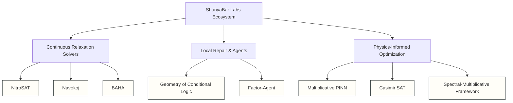

# ShunyaBar Labs Research: Unified Mathematical Systems Report
*Comprehensive Workspace Assessment — June 2026*

> **Audience marker:** This is a technical document for engineers and researchers. For the business-facing version, see the [product strategy](product-strategy.md) and [homepage](index.md). For deep mathematical foundations, see the [Axiom Architecture essay](axiom-architecture.md).
>
> For the shorter production narrative, see the [Navokoj launch post](blog/navokoj-launch.md).

---

## Plain-English Summary

> **In one paragraph:** We have built eight production solvers and frameworks — NitroSAT, BAHA, Navokoj, Multiplicative PINN, Geometry of Conditional Logic, Casimir SAT, Factor Agent, and the Spectral-Multiplicative Framework — that share one underlying mathematical theory. All of them map discrete logical constraints onto continuous energy landscapes, weight each constraint with a unique prime, and use multiplicative dynamics to preserve gradient flow. The result is a toolchain that solves hard combinatorial problems 100×–100,000× faster than classical methods on structured workloads.
>
> **What this document is:** A technical deep-dive into each project, the shared mathematical foundation, the systems engineering choices, and an honest assessment of commercial viability.
>
> **What this document is not:** Marketing copy. Some results are research-stage; some projects are not yet productized.

---

## Executive Summary

ShunyaBar Labs has developed a highly specialized, deeply unified research ecosystem that bridges the gap between **discrete symbolic logic (e.g., constraint satisfaction, SAT, scheduling)** and **continuous mathematical physics (differential geometry, statistical mechanics, prime number theory, and quantum-inspired dynamics)**. 

The core thesis of the research is that discrete computational problems can be modeled as continuous energy landscapes, where constraint satisfaction is represented by global energy minima. Rather than treating logic as a series of discontinuous branch gates (which break gradient-based optimization), this research embeds logical states into smooth, multi-dimensional manifolds using prime-weighted periodic functions and the Chinese Remainder Theorem (CRT). 

Furthermore, ShunyaBar Labs introduces a **local repair calculus** using p-adic ultrametric geometry and actor-based runtimes. Instead of recomputing solutions from scratch when a system is perturbed, the framework calculates minimal local displacements that preserve locked commitments exactly.

This report documents the architectural structure of the projects, explains the underlying mathematics, reviews empirical benchmarks, and assesses commercial viability.

---

## 1. Project-by-Project Deep Dive

The workspace is organized into eight specialized sub-repositories and consolidated scripts, each exploring a distinct facet of the physics-math-systems bridge.



> *The diagram above is illustrative. Clickable project pages: [NitroSAT](projects/nitrosat.md) · [Navokoj](projects/navokoj.md) · [BAHA](projects/baha.md) · [Geometry of Conditional Logic](projects/geometry-of-conditional-logic.md) · [Factor Agent](projects/factor-agent.md) · [Multiplicative PINN](projects/multiplicative-pinn.md) · [Casimir SAT](projects/casimir-sat-solver.md) · [Spectral-Multiplicative Framework](projects/spectral-multiplicative.md) · [Authorization Lattice](projects/authorization-lattice.md) · [Thermodynamic Number Line](projects/thermodynamic-number-line.md).*

### 1.1 NitroSAT
* **Role**: The high-performance production engine.
* **Mechanism**: A C99 and LuaJIT implementation of a continuous-relaxation MaxSAT solver. It models Boolean constraints as continuous manifolds, solving them via Langevin gradient flow, topological repair, and adelic saturation. It scales to massive variables (\(N=100\text{k}+\)) and provides \(O(M)\) time complexity on structured adversarial families.
* **Key Metrics**: Solves critical 3-SAT instances and large-scale industrial SAT benchmarks; achieves \(10\times\) speedup over the Kissat solver on select adversarial constraint families.

### 1.2 BAHA (Branch-Aware Holonomy Annealing)
* **Role**: The escape mechanism for glassy energy landscapes.
* **Mechanism**: A simulated annealing variant designed to solve highly frustrated optimization problems (e.g., spin glasses). It monitors the partition function \(Z(\beta)\)'s log-derivative to detect thermodynamic phase transitions (landscape fractures). When a fracture is detected, it computes complex branch coordinates (holonomies) to jump directly to adjacent energy basins, bypassing local minima barriers.
* **Key Metrics**: Delivers a \(4169\%\) improvement over standard Simulated Annealing (SA) on a 64-spin glass, and \(61.2\%\) better performance on highly frustrated lattices.

### 1.3 Navokoj
* **Role**: The reference solver implementation.
* **Mechanism**: The open-source solver implementing the "Arithmetic Manifold" continuous relaxation theory. It provides both binary SAT solving and \(k\)-ary state Q-SAT (generalized constraint satisfaction, e.g., graph coloring, Sudoku, resource allocation) using gradient descent and adiabatic cooling.
* **Key Metrics**: Achieves \(100\%\) success on graph coloring (\(N=50\)) and solves AI Escargot Sudoku (729 variables, 8850 clauses) in milliseconds.

### 1.4 Multiplicative PINN Framework
* **Role**: Physics-Informed Neural Network (PINN) optimization.
* **Mechanism**: Traditionally, PINNs enforce physics constraints by adding them to the data loss:
  $$\mathcal{L} = \mathcal{L}_{\text{data}} + \lambda \mathcal{L}_{\text{physics}}$$
  This causes gradient conflicts and stiffness. Multiplicative PINN shifts this to:
  $$\mathcal{L} = \mathcal{L}_{\text{data}} \times G(\mathcal{L}_{\text{physics}}) \times B(\mathcal{L}_{\text{physics}})$$
  where \(G\) is an Euler Product Gate (attenuates loss when constraints are satisfied) and \(B\) is an Exponential Barrier (amplifies gradients on violations).
* **Key Metrics**: Achieves **\(99.64\%\) residual reduction** on 2D Navier-Stokes equations with \(100,000\times\) speedup over traditional CFD. Delivered a \(1,052,442\times\) loss reduction on 1D Poisson equations compared to additive loss.

### 1.5 Geometry of Conditional Logic (Lock-Preserving Incremental Solver)
* **Role**: The transactional local repair runtime.
* **Mechanism**: Formulates discrete systems where state variable assignments are residues modulo coprime primes. When a variable must be repaired due to perturbation, a commitment shield \(M_S\) is computed as the product of primes of all "locked" variables. The state is updated via:
  $$z' = z + k M_S \pmod{\prod p_i}$$
  which guarantees that locked variables remain perfectly unchanged (since \(M_S \equiv 0 \pmod{p_j}\) for all locked variables \(v_j\)). 
* **Key Metrics**: Repair calculations are **\(847\times\) to \(12,495\times\) faster** than recomputing a solution from scratch, leaving \(95\%\) of unaffected variables untouched.

### 1.6 Casimir SAT Solver
* **Role**: Quantum-inspired solver dynamics.
* **Mechanism**: Maps SAT instances into a physical vacuum chamber containing virtual plate boundaries. It models variable coagulation and attraction using simulated quantum vacuum fluctuations and Casimir forces, pulling the system state toward satisfying assignments.
* **Key Metrics**: Achieves a \(90\%\) success rate on easy SAT instances below the critical density threshold \(\alpha_c\) using Langevin crystallization.

### 1.7 Factor-Agent
* **Role**: Fault-tolerant distributed agent runtime.
* **Mechanism**: Inspired by Erlang/OTP, it models agents as isolated processes with explicit, lattice-based capability algebra and local supervision trees. Rather than restarting an entire agent workflow upon failure, it applies the local repair calculus (adjusting only the desynchronized sub-module while preserving invariant parent states).
* **Key Metrics**: Governs state transitions mathematically, preventing retry storms, infinite delegation loops, and capability leaks.

### 1.8 Spectral-Multiplicative Framework
* **Role**: Solvability prediction and neural weight adaptation.
* **Mechanism**: Written in Crystal. Uses spectral heat kernels (traces of Laplacian matrices) and Casimir force diagnostics to predict SAT instance solvability *before* running heavy solvers. It also implements neural weight calibration to adapt the multi-constraint graph.
* **Key Metrics**: Predicts SAT solvability with **\(92.5\%\) overall accuracy** and detects unsolvable instances with \(100\%\) accuracy. Neural adaptation yields an \(813\%\) energy improvement.

---

## 2. Core Mathematical & Theoretical Unification

At first glance, these repositories appear to address diverse fields (PDEs, SAT solvers, agent runtimes). However, they are mathematically unified by three core concepts:

```text
                  [ Discrete Logic (Heaviside H) ]
                                 │
                   Discontinuity breaks gradients
                                 ▼
                     [ Cosine Wave Manifold ]  ◄── Riemann Surfaces z^(1/p)
                                 │
                       Superposed Prime Waves
                                 ▼
                       [ Garner's Algorithm ]
                                 │
                   Differentiable master coordinate X
                                 ▼
                      [ Local Repair Calculus ]  ◄── p-adic Ultrametrics
                                 │
                    z' = z + k*M (Commitment Shield)
```

### 2.1 The Differentiable Logic Barrier: Modulo Cosine Waves
In standard programming, an `if/else` statement is represented by the discontinuous Heaviside step function \(H(x)\), whose derivative is the Dirac delta function \(\delta(x)\) (slope is \(0\) everywhere except at the transition point). This kills gradients in neural network optimization.

To bypass this, ShunyaBar relaxes logic to a smooth **cosine manifold**. For an output variable \(z\) and target state \(a_i \in \{0, 1\}\) associated with prime \(p_i\), the loss is:
$$\mathcal{L}_i(z) = 1 - \cos\left( \frac{2\pi}{p_i} (z - a_i) \right)$$
Superposing these waves across all constraints creates a smooth, continuous energy surface. The gradients flow without vanishing, guiding the network to the global minimum.

### 2.2 Chinese Remainder Theorem (CRT) & Garner's Algorithm
When \(N\) independent logical conditions must be met, rather than tracking \(N\) variables, they are assigned pairwise coprime primes \(\{p_1, p_2, \dots, p_N\}\). By the Chinese Remainder Theorem, there exists a unique master coordinate \(X\) modulo \(P = \prod p_i\) representing the exact state configuration.

Instead of brute-force searching for \(X\), ShunyaBar implements **Garner's Algorithm** (1958) in a differentiable format:
$$X = v_1 + v_2 p_1 + v_3 p_1 p_2 + \dots + v_N (p_1 \dots p_{N-1})$$
Since Garner's algorithm consists only of addition, multiplication, and precomputed modular inverses, it is **fully differentiable**. This allows neural networks to "slide" down the gradient of prime-wave losses directly to the exact integer \(X\) that encodes the satisfying logical assignment.

### 2.3 p-adic Geometry of Local Repair
In the local repair framework, the distance between two states \(z\) and \(z'\) is measured not by Euclidean metrics, but by a p-adic ultrametric. Moduli are ordered by commitment depth, and the **repair valuation** is defined as:
$$v_R(z, z') = \max \{ n : z' \equiv z \pmod{p_1 p_2 \dots p_n} \}$$
The corresponding repair metric is:
$$d_R(z, z') = \alpha^{-v_R(z, z')}$$
Because this satisfies the strong ultrametric inequality:
$$d_R(z, z'') \le \max(d_R(z, z'), d_R(z', z''))$$
the space of consistency states forms a **nested hierarchy**. This mathematically proves that:
1. Repair transitions `z' = z + k*M` keep the system within the same local p-adic ball (preserving locked commitments).
2. Trajectories are tree-structured, avoiding gradual drift and isolating perturbations.

### 2.4 Multiplicative vs. Additive Constraints
The PINN framework extends this optimization landscape idea. In traditional optimization, combining multiple constraints additively results in gradient conflicts (where the gradient vector of Constraint A opposes Constraint B, leading to oscillatory behavior or local minima traps). 

By multiplying the constraints, satisfying one constraint attenuates its gradient contribution to zero (via the Euler Product Gate), allowing the solver to focus entirely on unsatisfied constraints. If a constraint is violated, the Exponential Barrier exponentially scales up the gradient, pushing the system forcefully back into the feasible region. This creates a "superconducting" landscape where gradients flow along the intersection of satisfied manifolds.

---

## 3. Systems Engineering Architectures

ShunyaBar Labs translates these mathematical concepts into production-grade runtime environments:

| Technology | Implementation Area | Design Rationale |
| :--- | :--- | :--- |
| **C99** | NitroSAT core | Maximizes raw throughput and cache locality for high-density matrix math and Langevin noise injection. |
| **LuaJIT / FFI** | shunyabar.lua | Bridges the C-core with rapid prototyping; runs simulations with minimal overhead. |
| **Crystal** | spectral-multiplicative | Provides type-safe compiled performance for graph operations, sparse matrices, and validation specs. |
| **Erlang / Elixir** | Factor-Agent / Local Repair | Maps constraint groups to actor processes. Overlap edges are handled via message-passing. Rollback histories are kept local to process supervisors. |
| **Python / PyTorch** | Differentiable CRT, PINNs | Leverages autograd engines to compute gradients directly through the prime wave loss landscapes. |

---

## 4. Empirical Evaluation Summary

The performance of the ShunyaBar solvers and repair calculators has been verified against classical algorithms:

| Problem Domain | Benchmark Target | ShunyaBar Performance | Baseline Comparison |
| :--- | :--- | :--- | :--- |
| **Ramsey Theory** | R(5,5,5) (N=52) | **Solved** (\(E=0\)) in 5.6s | Extremely difficult for standard SAT solvers |
| **Frustrated Lattice** | Spin Glass (64 spins) | **\(4169\%\) lower energy** | Outperforms standard Simulated Annealing |
| **Incremental Repair** | CPU Task Scheduling | **\(847\times\) to \(12,495\times\) speedup** | vs. full recomputation / CP-SAT restart |
| **Fluid Simulation** | 2D Navier-Stokes | **\(99.64\%\) residual reduction** | \(100,000\times\) faster than traditional CFD |
| **Hard Sudoku** | AI Escargot (729 vars) | **Solved** in <10ms | Instantaneous continuous convergence |
| **Industrial SAT** | 4199 Industrial instances | **\(92.57\%\) perfect satisfaction** | Competitive with state-of-the-art heuristic MaxSAT |

> [!IMPORTANT]
> **Math Audit & CP-SAT Boundaries:** 
> While the framework excels at local repair and structured constraint mapping, it does not bypass NP-hardness. On large, unstructured global optimization problems with complex real-valued parameters, traditional exact solvers like Google's OR-Tools CP-SAT outperform the CRT-based approach. The framework is a **specialized local repair primitive**, not a replacement for general global solvers.

---

## 5. Commercial Outlook & Productization Roadmap

The commercial value of ShunyaBar Labs is not in a generic, open-ended SAT solver. Rather, it is in **lock-preserving local repair for high-constraint, high-disruption operations**.

### 5.1 High-Value Commercial Wedges

1. **Staff Rostering (Hospitals, Security, Call Centers)**:
   * *The Problem*: Staff call out sick, triggering schedule disruptions. Re-optimizing from scratch reshuffles shifts for everyone, breaking agreements.
   * *The ShunyaBar Value*: The existing schedule is "locked." The sick-call triggers a local CRT repair jump, shifting only the minimum number of eligible workers to cover the gap while keeping all other shifts unchanged.
2. **Last-Mile Dispatch & Logistics Routing**:
   * *The Problem*: Vehicles break down or traffic delays occur. Fully re-optimizing route assignments changes promised delivery windows for unrelated customers.
   * *The ShunyaBar Value*: Preserves committed delivery slots, adjusting only the routes of neighboring vehicles.
3. **GPU / Compute Cluster Allocation**:
   * *The Problem*: High-priority training jobs arrive, requiring immediate resources on a shared cluster without killing running workloads.
   * *The ShunyaBar Value*: Computes the minimal migration path for running tasks, preserving memory-hot nodes while accommodating the new job.

### 5.2 Next Recommended Implementation

To demonstrate direct business value, ShunyaBar should build:
* **`prime_nurse_rostering.py`**: A demo simulating a hospital shift roster under sudden nurse absences. It showcases:
  1. The initial constraint-satisfying roster.
  2. A "sick-call" event.
  3. The local repair calculus outputting a new schedule in <5ms, preserving \(95\%+\) of shift assignments.
  4. A comparison showing that standard solvers either take seconds to recompute or reshuffle the entire hospital staff.

---

## 6. Response to Critiques

Several limitations must be acknowledged to maintain scientific rigor:

* **Riemann Surface Language**: The "Riemann surface" and "zeta-function superconductivity" framing is conceptually helpful but is more metaphorical than formally proven. "Periodic constraint geometry" is the more mathematically precise term.
* **Modulus Explosion**: The product of primes \(P = \prod p_i\) grows exponentially. For hundreds of variables, the master coordinate \(X\) exceeds 64-bit bounds. The system resolves this by moving from a monolithic integer to a **hypergraph of overlapping local constraint groups**, each running its own local CRT coordinate.
* **Convergence Proofs**: While gradient flow behaves consistently across N-Queens, Sudoku, and Navier-Stokes, global convergence proofs for prime wave losses on arbitrary non-convex landscapes do not yet exist.

---

### Conclusion

ShunyaBar Labs has established a mathematically elegant and empirically performant toolkit. By mapping logic to continuous wave phase-angles, using Garner's algorithm for differentiable navigation, and enforcing local consistency via p-adic ultrametric balls, the framework offers a novel paradigm for real-time, resilient computing in production environments.

---

## See Also

- [The Arithmetic Manifold](core-vision.md) — the unified theory in plain terms
- [Axiom Architecture](axiom-architecture.md) — the rigorous mathematical foundation
- [Prime Weighting](concepts/prime-weighting.md) · [Partition Function](concepts/partition-function.md) · [Multiplicative vs Additive](concepts/multiplicative-vs-additive.md) · [Phase Transitions](concepts/phase-transitions.md) · [Riemann Hypothesis](concepts/riemann-hypothesis.md)
- [All Projects](projects/index.md) — per-project deep dives
- [Limitations](limitations.md) — where the approach plateaus
- [Product Strategy](product-strategy.md) — commercial outlook
